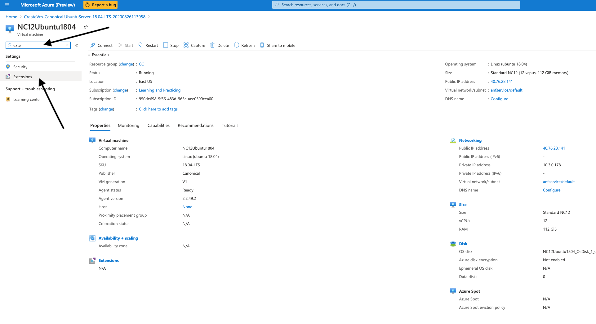
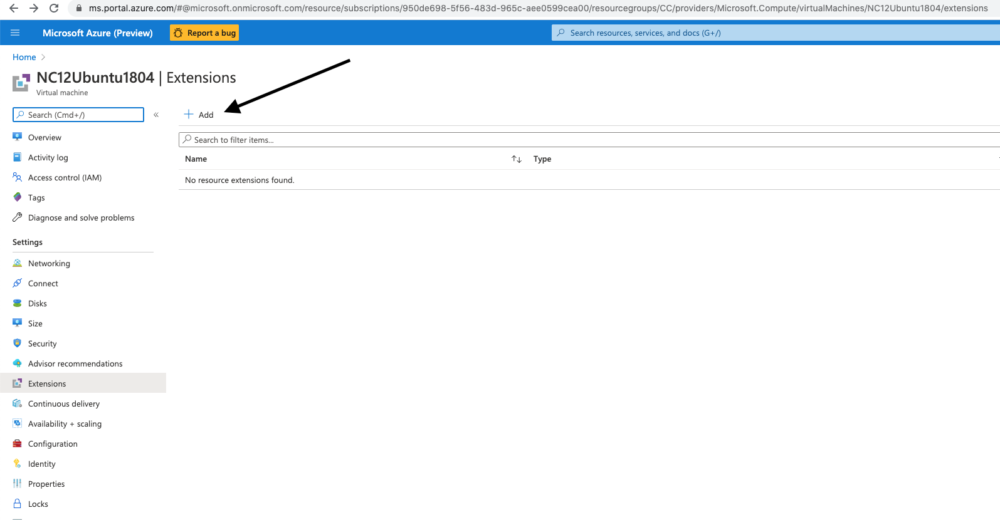
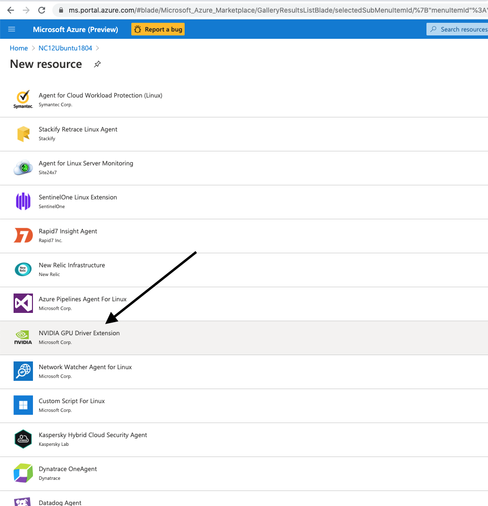
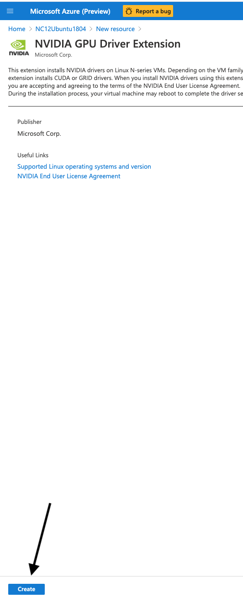
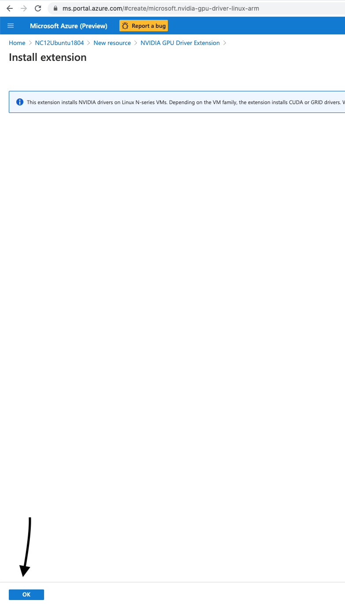
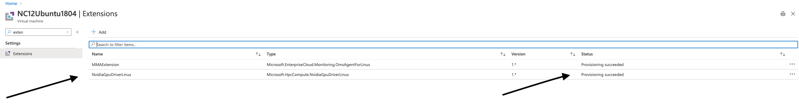

Install GPU Extension via Azure portal
--------------------------------------
In search bar search for Extension and follow the steps as depicted:  
step1:

step2:

steps3

step4

step5

 
After you click OK wait about 5 mins or check the status get succeeded 

